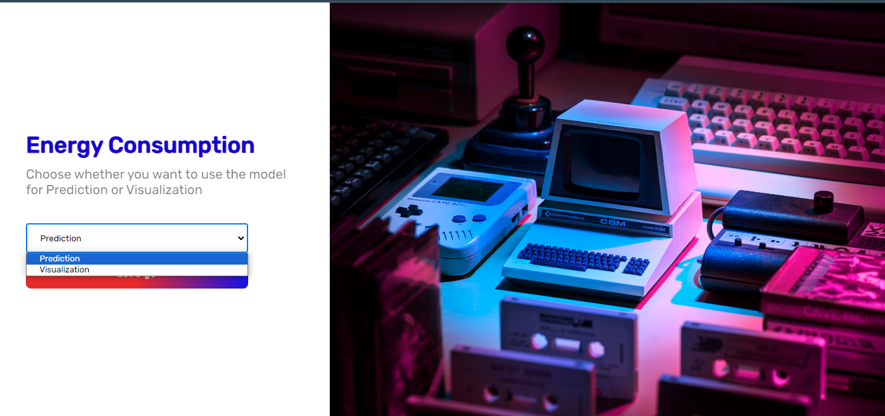
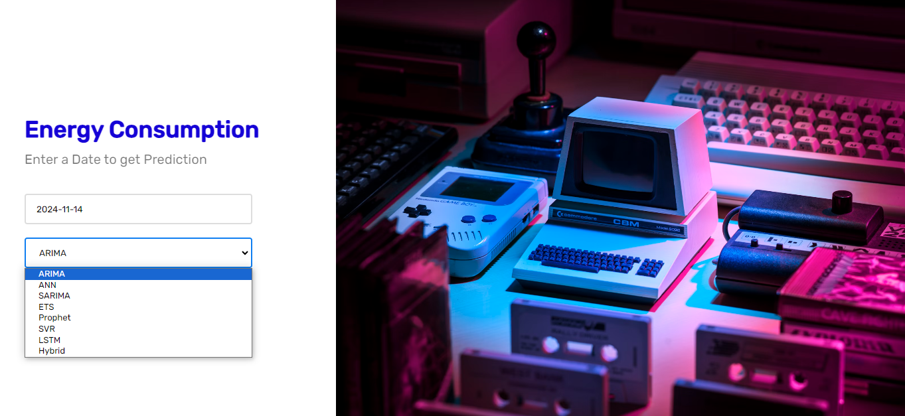
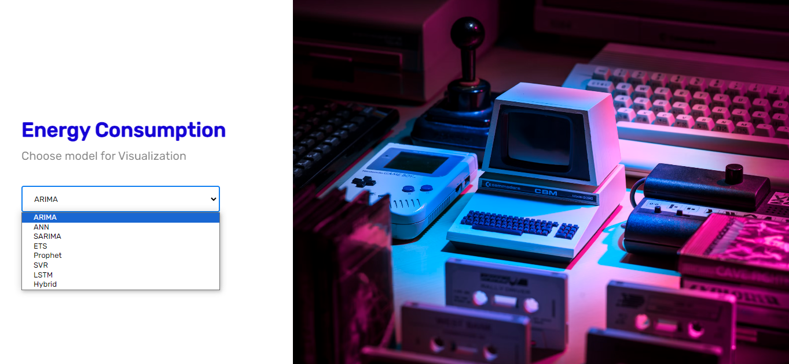
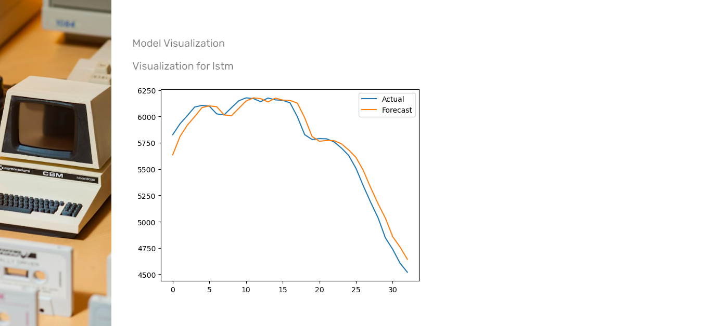
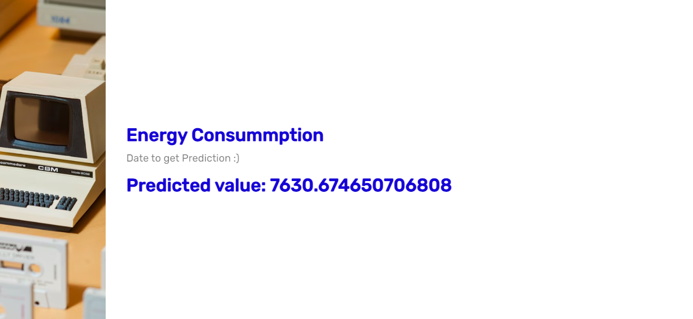

# Comprehensive Forecasting System with User Interface for Multiple Sectors

## Introduction

The Comprehensive Forecasting System is a sophisticated tool designed to provide accurate forecasts for various sectors, including finance, energy, and environment. The system integrates multiple time series forecasting models, such as ARIMA, ANN, SARIMA, Exponential Smoothing, Prophet, SVR, LSTM, and Hybrid ARIMA-ANN, to leverage the strengths of each model and enhance forecast accuracy. Additionally, a user-friendly front-end interface allows users to interact with the system easily, visualizing data and forecasts in real-time.

## Data Sources and Preprocessing

For this project, we primarily utilized energy consumption data. The preprocessing steps included cleaning the data by identifying and imputing or removing missing values, normalizing or standardizing the data to ensure uniform scaling, and stationarizing the data through differencing and logarithmic transformations to achieve stationarity.

## Model Development

- **ARIMA Configuration and Tuning**: ARIMA models were configured and tuned to capture non-stationary and seasonal patterns in the data.
- **ANN Design and Training**: Artificial Neural Networks were designed with varying architectures to model complex relationships in the data.
- **SARIMA (Seasonal ARIMA)**: SARIMA models extended ARIMA to handle seasonal time series data.
- **Exponential Smoothing (ETS)**: Exponential Smoothing models were employed to handle trends and seasonalities in the data.
- **Prophet**: The Prophet model was used for time series with strong seasonal effects and historical holidays.
- **Support Vector Regression (SVR)**: SVR models were applied to capture nonlinear relationships in the data.
- **Long Short-Term Memory (LSTM)**: LSTM networks were utilized for sequence prediction problems, effectively learning order dependence in the data.
- **Hybrid Models Integration**: Hybrid ARIMA-ANN models combined the strengths of ARIMA and ANN to improve forecast accuracy.

## Frontend Development

The frontend interface was developed using ReactJS for dynamic and responsive user interaction. Users can easily select datasets, initiate model comparisons, and view forecasts through an intuitive UI.

## Testing and Validation

- **Model Testing**: Historical data was used to validate the models' predictions, ensuring reliability and accuracy.
- **System Testing**: Unit tests were conducted for individual components, and integration tests were performed for overall system functionality to confirm proper operation without errors.

## Deployment

The application was deployed to a scalable platform, making the forecasting system accessible to users for real-time forecasting.

## Conclusion

The Comprehensive Forecasting System provides an advanced solution for forecasting across multiple sectors. By integrating various time series models and offering a user-friendly interface, the system enables accurate and efficient forecasting for diverse datasets. With thorough testing and validation, the system ensures reliability and robust performance in real-world applications.

## Acknowledgments

We would like to acknowledge the contributions of all team members to the successful development and implementation of the Comprehensive Forecasting System. Additionally, we extend our gratitude to the project supervisors and stakeholders for their support and guidance throughout the project duration.

